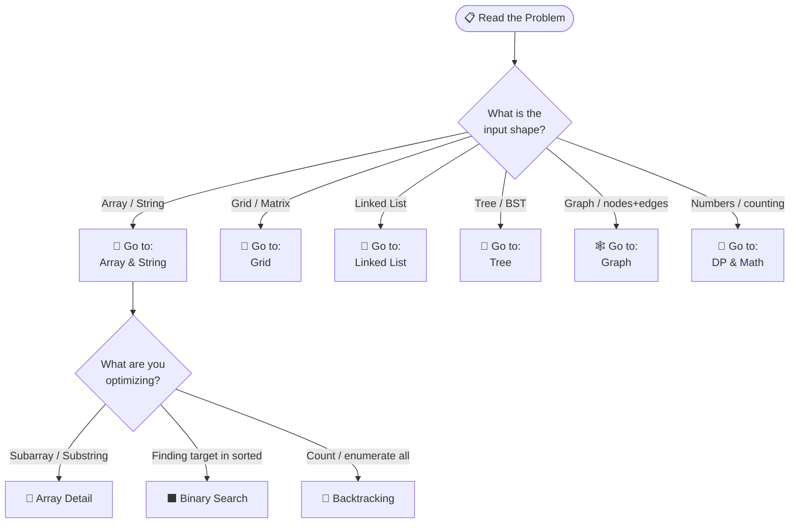
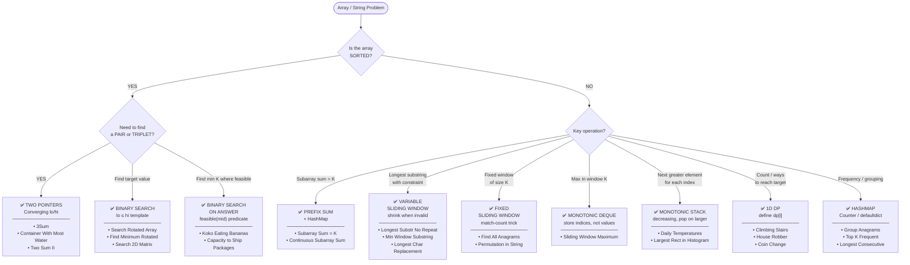
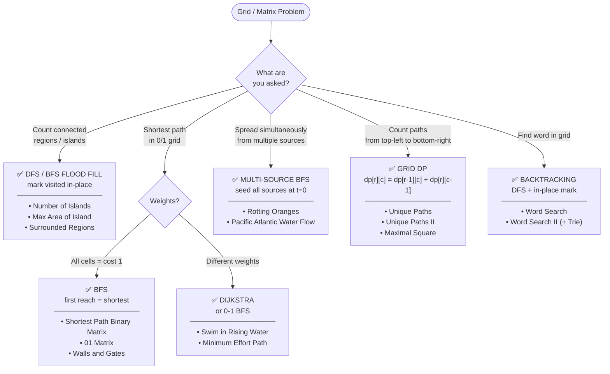
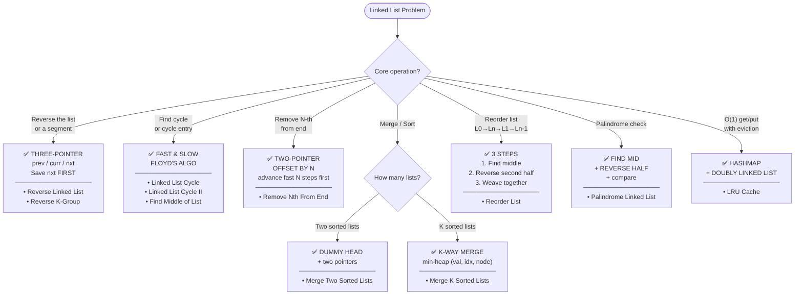
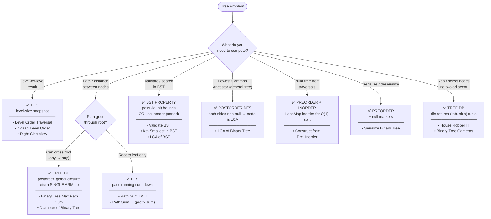
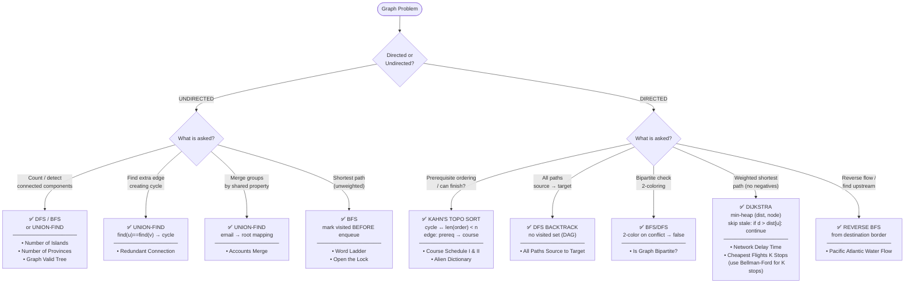
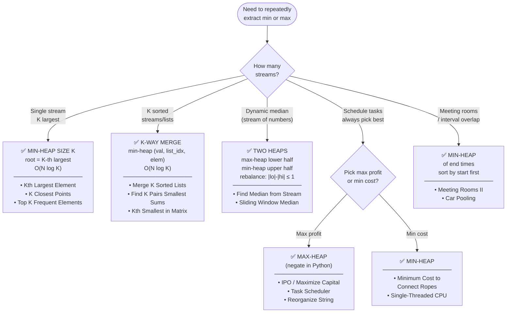

# Medium-Level Problem Flowchart — Google L3

> **How to use:** Read the problem → scan for signals → follow the arrow.
> Each node is a decision. Leaf nodes (→ boxes) are the algorithm to code.

---

## 🗺 MASTER ROUTER — Start Here



---

## 🔵 Array & String Flowchart



---

## 🔲 Grid / Matrix Flowchart



---

## 🔗 Linked List Flowchart



---

## 🌲 Tree Flowchart



---

## 🕸 Graph Flowchart



---

## 🧩 DP / Backtracking Flowchart

```mermaid
flowchart TD
    D(["Optimization /\nCounting / Enumeration"])

    D --> D1{"Do you need\nALL solutions?"}

    D1 -->|"YES — enumerate all"| D2{"Input\nhas duplicates?"}
    D2 -->|NO| D3["✅ BACKTRACKING\n+ start index\ncopy path at base case\n─────────────────\n• Subsets\n• Combination Sum\n• Permutations\n• Generate Parentheses"]
    D2 -->|YES| D4["✅ BACKTRACKING\n+ DEDUP\nsort first;\nskip if nums[i]==nums[i-1]\n─────────────────\n• Subsets II\n• Permutations II\n• Combination Sum II"]

    D1 -->|"NO — find optimal\nor count"| D5{"Overlapping\nsubproblems?"}

    D5 -->|YES| D6{"State space\nshape?"}

    D6 -->|"1D sequence"| D7["✅ 1D DP\ndp[i] from dp[i-1] or dp[i-2]\n─────────────────\n• Climbing Stairs\n• House Robber\n• Decode Ways\n• Word Break"]

    D6 -->|"Two sequences\nor 2D"| D8["✅ 2D DP\ndp[i][j] = match or skip\n─────────────────\n• LCS\n• Edit Distance\n• Interleaving String\n• Unique Paths"]

    D6 -->|"Pick items with\nweight / budget"| D9{"Items reusable?"}
    D9 -->|NO| D10["✅ 0/1 KNAPSACK\niterate W BACKWARD\n─────────────────\n• Partition Equal Subset\n• Target Sum\n• Last Stone Weight II"]
    D9 -->|YES| D11["✅ UNBOUNDED KNAPSACK\niterate W FORWARD\n─────────────────\n• Coin Change I\n• Coin Change II\n• Combination Sum IV"]

    D6 -->|"Grid movement\n(right/down)"| D12["✅ GRID DP\ndp[r][c] = dp[r-1][c] + dp[r][c-1]\n─────────────────\n• Unique Paths\n• Maximal Square"]

    D6 -->|"Stock buy/sell\nwith states"| D13["✅ STATE MACHINE DP\ntrack held/cash/cooldown\n─────────────────\n• Stock with Cooldown\n• Stock with Fee"]

    D5 -->|NO — greedy\nworks"| D14{"Problem type?"}

    D14 -->|"Interval / scheduling"| D15["✅ GREEDY\nsort by END time\n─────────────────\n• Merge Intervals\n• Non-overlapping Intervals\n• Meeting Rooms II"]

    D14 -->|"Jump / reach end"| D16["✅ GREEDY\ntrack farthest reachable\n─────────────────\n• Jump Game I & II"]

    D14 -->|"Task scheduling\nwith cooldown"| D17["✅ GREEDY / MATH\nmax_f formula\n─────────────────\n• Task Scheduler"]
```

---

## 🟡 Heap / Priority Queue Flowchart



---

## ⚡ One-Line Signal Map (Quick Scan)

> Scan this in 30 seconds. Find your keyword. Jump to the right flowchart.

```
SIGNAL                              → PATTERN               → FLOWCHART
─────────────────────────────────────────────────────────────────────────
sorted + find pair/triplet          → Two Pointers           → Array
unsorted + find sum pair            → HashMap complement     → Array
subarray sum = K                    → Prefix Sum + Map       → Array
longest / shortest substring        → Sliding Window         → Array
max in window of K                  → Monotonic Deque        → Array
next greater element                → Monotonic Stack        → Array
find target in sorted               → Binary Search          → Array
minimize K where feasible           → BS on Answer           → Array
count connected regions             → DFS/BFS Flood Fill     → Grid
shortest path in 0/1 grid           → BFS                    → Grid
shortest path with weights          → Dijkstra               → Grid
spread from multiple sources        → Multi-source BFS       → Grid
count paths top-left→bottom-right   → Grid DP                → Grid
find word in grid                   → Backtracking + mark    → Grid
reverse / reorder list              → Three Pointers         → Linked List
cycle / midpoint detection          → Fast & Slow Pointers   → Linked List
merge K sorted                      → K-way Heap             → Linked List
level-by-level output               → BFS + snapshot         → Tree
max path / diameter                 → Tree DP postorder      → Tree
validate BST / search BST           → Bounds DFS or Inorder  → Tree
lowest common ancestor              → Postorder DFS          → Tree
prerequisite / dependency           → Kahn's Topo Sort       → Graph
cycle in directed graph             → Kahn's or 3-color DFS  → Graph
connectivity in undirected          → Union-Find / DFS       → Graph
weighted shortest path              → Dijkstra               → Graph
all combinations / subsets          → Backtracking           → DP
minimize / maximize (overlapping)   → DP                     → DP
interval scheduling / merge         → Greedy (sort by end)   → DP
K-th largest / dynamic extremum     → Heap                   → Heap
dynamic median                      → Two Heaps              → Heap
merge K sorted streams              → K-way Heap             → Heap
```

---

← [DECISION_GUIDE.md](./DECISION_GUIDE.md) · ← [ds_tree.md](../01-data-structures/ds_tree.md) · ← [algorithm_tree.md](../02-algorithms/algorithm_tree.md)
