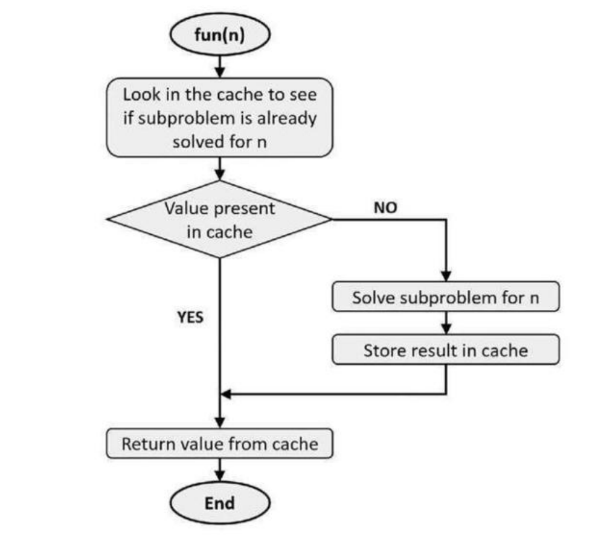

# Dynamic programming

Dynamic programming (DP) is a method used to solve problems by breaking them down into smaller subproblems, solving each subproblem just once, and storing their solutions. The main idea is to avoid recomputation of the same subproblem, which often occurs in naive recursive approaches, such as in problems with overlapping subproblems or optimal substructure.


DP is just special case of recursion where we try to solve the problem using recursion but storing the solution which we had already solved before. either by memozation or tabulation


<table data-header-hidden><thead><tr><th width="143.55206298828125"></th><th></th><th></th></tr></thead><tbody><tr><td>Aspect</td><td>Top-Down Approach (Memoization)</td><td>Bottom-Up Approach (Tabulation)</td></tr><tr><td>Definition</td><td>Solve the problem recursively, breaking it down into smaller subproblems, and store the results to avoid recomputation.</td><td>Solve the problem iteratively, starting from the smallest subproblems and building up to the final solution.</td></tr><tr><td>Direction of Solving</td><td>Starts from the main problem and goes down to base cases.</td><td>Starts from base cases and works up to the main problem.</td></tr><tr><td>Implementation</td><td>Usually implemented using recursion + caching (e.g., hash map or array).</td><td>Usually implemented using loops and arrays.</td></tr><tr><td>Storage of Results</td><td>Stores results of solved subproblems when first computed (lazy evaluation).</td><td>Pre-fills results of all subproblems in a table (eager evaluation).</td></tr><tr><td>Function Calls</td><td>Multiple recursive calls; may cause function call overhead.</td><td>No recursion; avoids function call overhead.</td></tr><tr><td>Space Usage</td><td>Needs recursion stack space + memoization storage.</td><td>Needs only table/array storage (no recursion stack).</td></tr><tr><td>Ease of Writing</td><td>Often easier to write for complex problems since it follows the natural recursive formulation.</td><td>May require more effort to define the iteration order correctly.</td></tr><tr><td>Performance</td><td>Slightly slower due to recursion overhead.</td><td>Often faster because it’s purely iterative.</td></tr><tr><td>When to Use</td><td>When recursion is intuitive and problem size is not too large to cause stack overflow.</td><td>When iteration order is easy to determine and large recursion depth may cause issues.</td></tr></tbody></table>

### Key Concepts in Dynamic Programming:

1. **Optimal Substructure**: A problem exhibits optimal substructure if its optimal solution can be constructed from optimal solutions of its subproblems. This is essential for dynamic programming to be applicable.
2. **Overlapping Subproblems**: Many problems can be broken down into subproblems that are reused multiple times. In dynamic programming, these subproblems are solved once and stored (memoized) for future reference.
3. **Memoization \[top down]**: Storing the results of expensive function calls and reusing them when the same inputs occur again. This is usually implemented using recursion and a hash table or array to store results.
4. **Tabulation \[Bottoms up]** : Instead of using recursion, solutions to subproblems are stored in a table and filled in a bottom-up manner. This avoids the overhead of recursive function calls and allows the solution to be built iteratively.
5. **Top-Down vs Bottom-Up**:
   * **Top-Down (Memoization)**: This approach uses recursion and memoization to store results as needed, solving only the subproblems required by the original problem. In this the result of previous runs is stored up in a specialized data structure and uses that data to solve the next problems.
   * **Bottom-Up (Tabulation)**: This method starts solving the smallest subproblems first and iteratively builds up the solution to the original problem, typically using a loop and an array. in this it doens't stores the result in a special data structure, it generally stores the previous result in the stack and uses that to calculate the final result
6. Interview tip --
   1. A recursive exponential-time solution is usually an acceptable answer in the intervien\
      because even interviewer understand that the available time is limited.
   2. It is good intervien practice to put a quick not-so-optimiged fully-working and bugfree solution on the table and then work on optimizing it, instead of getting stuck and not\
      responding in the process of coming up with most the optimal solution.
   3. First it will create an impression on the interviewer that you can handle unknown\
      problems methodically and come to a quick solution, second it will comfort you that you\
      have at least given one fool-proof working solution, so even ifyou are not able to give the\
      best solution, it is still not that bad.
   4. Also, you may not get time to execute all the steps during the intervien. Going\
      abead with the quick recursive solution will go in your favor. Just make sure to handle\
      the boundary condition properly in the implementation and leave no bug in the code.
   5. Once you present that solution on the paper and tell the interviewer that, it can be\
      optimized further if we use dynamic programming, Interviewer may take it on the face\
      value and give you complete creditfor optimized solution without even asking you for the\
      solution.&#x20;
   6. If there is time, the interviewer may ask you to optimize your solution.\
      Having said that, if you can come up with the optimized DP answer easily then\
      you must go for it.
   7. At point-2 we have a working solution. It may be taking more time than the optimal\
      solution, but itis syntactically and semantically correct.
   8. It may be sufficient to solve the problem till this point during an interview. But you\
      should apprise the interviewer that it is not the most optimal solution and you can further\
      optimize it by using DP.

***

### Steps to Solve a Problem Using Dynamic Programming:

1. **Define the State**: Determine the state variables that represent the subproblems. These variables are usually related to the input, and their values help in transitioning between different subproblems.
2. **Recurrence Relation**: Identify the recurrence relation that connects the current problem with its subproblems. This defines how the solution to the problem is built from the solutions to smaller subproblems.
3. **Base Case**: Define the base case(s) of the recursion. These are the smallest possible subproblems, usually where the input size is minimum or trivial to solve.
4. **Decision-making**: At each step of the recursion, decide which subproblem to solve based on which subproblem leads to the optimal solution. This often involves evaluating all possible choices.
5. **Memoization or Tabulation**: Implement either memoization (top-down) or tabulation (bottom-up) to store the solutions to subproblems to avoid recomputation.

For example — calculate fibbonaci sequence.

normal solution --

```python
def fibonacci_iterative(n):
    """
    Generates the first 'n' Fibonacci numbers using an iterative method.
    """
    if n <= 0:
        return []
    elif n == 1:
        return [0]
    else:
        fib_sequence = [0, 1]
        for _ in range(2, n):
            next_fib = fib_sequence[-1] + fib_sequence[-2]
            fib_sequence.append(next_fib)
        return fib_sequence

# Example usage:
num_terms = 10
fib_series = fibonacci_iterative(num_terms)
print(f"Fibonacci sequence (first {num_terms} terms): {fib_series}")

```

recursive solution \[top down] \[this is also dp] --

```python
def fibonacci_recursive(n):
    """
    Calculates the nth Fibonacci number using a top-down recursive approach.

    Args:
        n: The index of the Fibonacci number to calculate (non-negative integer).

    Returns:
        The nth Fibonacci number.
    """
    if n <= 1:
        return n  # Base cases: F(0) = 0, F(1) = 1
    else:
        # Recursive case: F(n) = F(n-1) + F(n-2)
        return fibonacci_recursive(n - 1) + fibonacci_recursive(n - 2)

# Example usage:
print(f"Fibonacci(0): {fibonacci_recursive(0)}")
print(f"Fibonacci(1): {fibonacci_recursive(1)}")
print(f"Fibonacci(5): {fibonacci_recursive(5)}")
print(f"Fibonacci(10): {fibonacci_recursive(10)}")
```

recursion \[bottom up] \[ this is also dp]

def fibonacci\_bottom\_up\_recursive(n, memo={}): """ Calculates the nth Fibonacci number using a bottom-up approach with recursion (memoization).

```python
def fibonacci_bottom_up_recursive(n, memo={}):
    """
    Calculates the nth Fibonacci number using a bottom-up approach with recursion (memoization).

    Args:
        n: The index of the Fibonacci number to calculate (non-negative integer).
        memo: A dictionary to store previously calculated Fibonacci numbers.

    Returns:
        The nth Fibonacci number.
    """
    if n <= 1:
        return n
    
    if n in memo:
        return memo[n]
    
    # Recursively calculate and store the result
    memo[n] = fibonacci_bottom_up_recursive(n - 1, memo) + fibonacci_bottom_up_recursive(n - 2, memo)
    return memo[n]

# Example usage:
n_terms = 10
print(f"Fibonacci sequence up to {n_terms} terms:")
for i in range(n_terms):
    print(fibonacci_bottom_up_recursive(i))
```


## Memoization vs tabulation OR top down vs bottom up

* memoization is also dynamic programming. Some authors in fact use the term "Memoized Dynamic Programming" or "Top-Down dynamic programming for Memoization and they use "Bottom-up dynamic programming' to describe what we are calling Dynamic Programming here.
* In this book, we have used the terms Memoization and 'DynamicProgramming, to refer to top-down and bottom-up approaches of problem solving where a subproblem is solved only once.
* Both Memoization and Dynamic Programming solves individual subproblem only once.\
  Memoization uses recursion and work top-down, whereas Dynamic Programming moves in opposite direction solving the problem bottom-up.
* Dynamic programming unroll the recursion and move in opposite direction to Memoization.
* Major applications of DP is in solving complex problems bottom-up where the problem has optimal substructure and subproblems overlaps. The challenge with Dynamic Programming is that it is not always intuitive esp. for complex problems.
* We have learnt about recursion, memoization and dynamic programming in previous chapters. First two are top-down approach to problem solving while DP solves a problem in bottom-up manner.
* In top-down we have an understanding of the destination initially and we develop the means required to reach there. On the other hand, bottomup has all the means available and we move toward the destination. Belowis an interesting analogy:
  * Top-down: Firstyou say I will take over the world. How willyou do that? You say, I\
    will take over Asia first. How willyou do that? I will take over India first. How will\
    you do that? I willfirst become the ChiefMinister ofDelhi, etc. etc.
  * Bottom-up: You say, I will become the CM of Delbi. Then will take over India, then\
    all other countries in Asia and finally I will take over the whole world.
* Top-down is usually more intuitive because we get a bird's eye view and a broader understanding of the solution. The simplest example of top-down approach are Binary tree algorithms. The algorithm of pre-order traversal is:
* This algorithm, starts from the top and moves toward leaves. Most of the Binary tree algorithms are like this only. We start from the top, traverse the tree in some order and keep making decisions on the way.
* Negatives ofBottom-up DP
  * In top-down approach (recursion or memoized) we do not solve all the subproblems, we solve only those problems that need to be solved to get the solution of main problem. In bottom-up dynamic programming, all the subproblems are solved before getting to the main\
    problem.
  * We may therefore (very rarely) be solving more subproblems in top-down DP than required. The DP solutions should be properly framed to remove this ill-effect. Consider the below example:

Great! Here are 10 classic dynamic programming problems, each solved using both:

* ✅ Top-down (Memoization)
  *

      <figure><figcaption></figcaption></figure>
* ✅ Bottom-up (Tabulation)
  *

      <figure><figcaption></figcaption></figure>

***

### ✅ 1.&#x20;

### Fibonacci Numbers

<br>

Problem: Return the nth Fibonacci number.

<br>

#### Memoization:

```
def fib_memo(n, memo={}):
    if n <= 1:
        return n
    if n not in memo:
        memo[n] = fib_memo(n-1, memo) + fib_memo(n-2, memo)
    return memo[n]
```

#### Tabulation:

```
def fib_tab(n):
    if n <= 1:
        return n
    dp = [0, 1]
    for i in range(2, n+1):
        dp.append(dp[i-1] + dp[i-2])
    return dp[n]
```

***

### ✅ 2.&#x20;

### Climbing Stairs

Problem: You can climb 1 or 2 steps. How many ways to reach the nth step?

Memoization:

```python
def climb_stairs_memo(n, memo={}):
    if n <= 2:
        return n
    if n not in memo:
        memo[n] = climb_stairs_memo(n-1, memo) + climb_stairs_memo(n-2, memo)
    return memo[n]
```

#### Tabulation:

```python
def climb_stairs_tab(n):
    if n <= 2:
        return n
    dp = [0, 1, 2]
    for i in range(3, n+1):
        dp.append(dp[i-1] + dp[i-2])
    return dp[n]
```

***

### ✅ 3.&#x20;

### House Robber

<br>

Problem: Max sum of non-adjacent elements in array.

<br>

#### Memoization:

```python
def rob_memo(nums, i=0, memo={}):
    if i >= len(nums):
        return 0
    if i not in memo:
        memo[i] = max(rob_memo(nums, i+1, memo), nums[i] + rob_memo(nums, i+2, memo))
    return memo[i]
```

#### Tabulation:

```python
def rob_tab(nums):
    if not nums:
        return 0
    if len(nums) == 1:
        return nums[0]
    dp = [0] * len(nums)
    dp[0], dp[1] = nums[0], max(nums[0], nums[1])
    for i in range(2, len(nums)):
        dp[i] = max(dp[i-1], dp[i-2] + nums[i])
    return dp[-1]
```

***

### ✅ 4.&#x20;

### Longest Common Subsequence

<br>

Problem: Find LCS of strings s1 and s2.

<br>

#### Memoization:

```python
def lcs_memo(s1, s2, i=0, j=0, memo={}):
    if i == len(s1) or j == len(s2):
        return 0
    if (i, j) not in memo:
        if s1[i] == s2[j]:
            memo[(i, j)] = 1 + lcs_memo(s1, s2, i+1, j+1, memo)
        else:
            memo[(i, j)] = max(lcs_memo(s1, s2, i+1, j, memo), lcs_memo(s1, s2, i, j+1, memo))
    return memo[(i, j)]
```

#### Tabulation:

```python
def lcs_tab(s1, s2):
    dp = [[0]*(len(s2)+1) for _ in range(len(s1)+1)]
    for i in range(len(s1)-1, -1, -1):
        for j in range(len(s2)-1, -1, -1):
            if s1[i] == s2[j]:
                dp[i][j] = 1 + dp[i+1][j+1]
            else:
                dp[i][j] = max(dp[i+1][j], dp[i][j+1])
    return dp[0][0]
```

***

### ✅ 5.&#x20;

### 0/1 Knapsack

<br>

Problem: Maximize value with weight limit W.

<br>

#### Memoization:

```python
def knapsack_memo(wt, val, W, n, memo={}):
    if n == 0 or W == 0:
        return 0
    if (n, W) not in memo:
        if wt[n-1] <= W:
            memo[(n, W)] = max(val[n-1] + knapsack_memo(wt, val, W - wt[n-1], n-1, memo),
                                knapsack_memo(wt, val, W, n-1, memo))
        else:
            memo[(n, W)] = knapsack_memo(wt, val, W, n-1, memo)
    return memo[(n, W)]
```

#### Tabulation:

```python
def knapsack_tab(wt, val, W):
    n = len(wt)
    dp = [[0]*(W+1) for _ in range(n+1)]
    for i in range(1, n+1):
        for w in range(W+1):
            if wt[i-1] <= w:
                dp[i][w] = max(val[i-1] + dp[i-1][w - wt[i-1]], dp[i-1][w])
            else:
                dp[i][w] = dp[i-1][w]
    return dp[n][W]
```

***

### ✅ 6.&#x20;

### Partition Equal Subset Sum

<br>

Problem: Can array be partitioned into 2 subsets with equal sum?

<br>

#### Memoization:

```python
def can_partition_memo(nums):
    total = sum(nums)
    if total % 2 != 0:
        return False
    target = total // 2
    memo = {}

    def dfs(i, curr):
        if curr == target:
            return True
        if i >= len(nums) or curr > target:
            return False
        if (i, curr) not in memo:
            memo[(i, curr)] = dfs(i+1, curr + nums[i]) or dfs(i+1, curr)
        return memo[(i, curr)]

    return dfs(0, 0)
```

#### Tabulation:

```python
def can_partition_tab(nums):
    total = sum(nums)
    if total % 2 != 0:
        return False
    target = total // 2
    dp = [False] * (target + 1)
    dp[0] = True
    for num in nums:
        for i in range(target, num-1, -1):
            dp[i] = dp[i] or dp[i-num]
    return dp[target]
```

***

### ✅ 7.&#x20;

### Coin Change (Minimum Coins)

<br>

Problem: Find the minimum number of coins that make up amount.

<br>

#### Memoization:

```python
def coin_change_memo(coins, amount, memo={}):
    if amount == 0:
        return 0
    if amount < 0:
        return float('inf')
    if amount not in memo:
        memo[amount] = min(coin_change_memo(coins, amount - c, memo) + 1 for c in coins)
    return memo[amount] if memo[amount] != float('inf') else -1
```

#### Tabulation:

```python
def coin_change_tab(coins, amount):
    dp = [float('inf')] * (amount+1)
    dp[0] = 0
    for i in range(1, amount+1):
        for coin in coins:
            if i - coin >= 0:
                dp[i] = min(dp[i], dp[i - coin] + 1)
    return dp[amount] if dp[amount] != float('inf') else -1
```

***

### ✅ 8.&#x20;

### Longest Increasing Subsequence

<br>

Problem: Return the length of LIS.

<br>

#### Memoization:

```python
def lis_memo(nums):
    memo = {}

    def dp(i, prev):
        if i == len(nums):
            return 0
        key = (i, prev)
        if key not in memo:
            taken = 0
            if prev < 0 or nums[i] > nums[prev]:
                taken = 1 + dp(i+1, i)
            not_taken = dp(i+1, prev)
            memo[key] = max(taken, not_taken)
        return memo[key]

    return dp(0, -1)
```

#### Tabulation:

```python
def lis_tab(nums):
    n = len(nums)
    dp = [1] * n
    for i in range(n):
        for j in range(i):
            if nums[i] > nums[j]:
                dp[i] = max(dp[i], dp[j]+1)
    return max(dp)
```

***

### ✅ 9.&#x20;

### Edit Distance

<br>

Problem: Minimum edits to convert word1 to word2.

<br>

#### Memoization:

```python
def edit_distance_memo(s1, s2, i=0, j=0, memo={}):
    if i == len(s1):
        return len(s2) - j
    if j == len(s2):
        return len(s1) - i
    if (i, j) not in memo:
        if s1[i] == s2[j]:
            memo[(i, j)] = edit_distance_memo(s1, s2, i+1, j+1, memo)
        else:
            insert = 1 + edit_distance_memo(s1, s2, i, j+1, memo)
            delete = 1 + edit_distance_memo(s1, s2, i+1, j, memo)
            replace = 1 + edit_distance_memo(s1, s2, i+1, j+1, memo)
            memo[(i, j)] = min(insert, delete, replace)
    return memo[(i, j)]
```

#### Tabulation:

```python
def edit_distance_tab(s1, s2):
    m, n = len(s1), len(s2)
    dp = [[0]*(n+1) for _ in range(m+1)]

    for i in range(m+1):
        for j in range(n+1):
            if i == 0:
                dp[i][j] = j
            elif j == 0:
                dp[i][j] = i
            elif s1[i-1] == s2[j-1]:
                dp[i][j] = dp[i-1][j-1]
            else:
                dp[i][j] = 1 + min(dp[i-1][j],    # delete
                                   dp[i][j-1],    # insert
                                   dp[i-1][j-1])  # replace
    return dp[m][n]
```

***

### ✅ 10.&#x20;

### Subset Sum

<br>

Problem: Can we form a subset that sums to target?

<br>

#### Memoization:

```python
def subset_sum_memo(nums, target, i=0, memo={}):
    if target == 0:
        return True
    if i == len(nums):
        return False
    if (i, target) not in memo:
        include = subset_sum_memo(nums, target - nums[i], i+1, memo)
        exclude = subset_sum_memo(nums, target, i+1, memo)
        memo[(i, target)] = include or exclude
    return memo[(i, target)]
```

#### Tabulation:

```python
def subset_sum_tab(nums, target):
    n = len(nums)
    dp = [[False]*(target+1) for _ in range(n+1)]
    for i in range(n+1):
        dp[i][0] = True
    for i in range(1, n+1):
        for j in range(target+1):
            if nums[i-1] <= j:
                dp[i][j] = dp[i-1][j] or dp[i-1][j - nums[i-1]]
            else:
                dp[i][j] = dp[i-1][j]
    return dp[n][target]
    
```


### ✅ 11. Maximum Subarray Sum (Kadane’s Algorithm)

\
Problem: Find the contiguous subarray with the maximum sum.

#### Memoization:

```python
def max_subarray_memo(nums):
    memo = {}

    def helper(i):
        if i == 0:
            return nums[0]
        if i not in memo:
            memo[i] = max(nums[i], nums[i] + helper(i - 1))
        return memo[i]

    return max(helper(i) for i in range(len(nums)))
```

#### Tabulation:

```python
def max_subarray_tab(nums):
    current = maximum = nums[0]
    for i in range(1, len(nums)):
        current = max(nums[i], current + nums[i])
        maximum = max(maximum, current)
    return maximum
```

***

### ✅ 12. Palindromic Substrings Count

Problem: Count all palindromic substrings.

Memoization:

```python
def count_palindromes_memo(s):
    memo = {}
    count = 0

    def is_pal(i, j):
        if i >= j:
            return True
        if (i, j) not in memo:
            memo[(i, j)] = s[i] == s[j] and is_pal(i+1, j-1)
        return memo[(i, j)]

    for i in range(len(s)):
        for j in range(i, len(s)):
            if is_pal(i, j):
                count += 1
    return count
```

#### Tabulation:

```python
def count_palindromes_tab(s):
    n = len(s)
    dp = [[False]*n for _ in range(n)]
    count = 0
    for i in range(n):
        dp[i][i] = True
        count += 1
    for l in range(2, n+1):
        for i in range(n-l+1):
            j = i + l - 1
            if s[i] == s[j] and (l == 2 or dp[i+1][j-1]):
                dp[i][j] = True
                count += 1
    return count
```

***

### ✅ 13. Min Cost Climbing Stairs

<br>

Problem: You can pay cost\[i] to step i, and can climb 1 or 2 steps. Min cost to top?

<br>

#### Memoization:

```python
def min_cost_memo(cost, i=0, memo={}):
    if i >= len(cost):
        return 0
    if i not in memo:
        memo[i] = cost[i] + min(min_cost_memo(cost, i+1, memo), min_cost_memo(cost, i+2, memo))
    return memo[i]
```

#### Tabulation:

```python
def min_cost_tab(cost):
    n = len(cost)
    dp = [0] * (n+1)
    for i in range(2, n+1):
        dp[i] = min(dp[i-1] + cost[i-1], dp[i-2] + cost[i-2])
    return dp[n]
```

***

### ✅ 14. Unique Paths in Grid

Problem: From top-left to bottom-right in m×n grid. Only move right/down.

Memoization:

```python
def unique_paths_memo(m, n, memo={}):
    if m == 1 or n == 1:
        return 1
    if (m, n) not in memo:
        memo[(m, n)] = unique_paths_memo(m-1, n, memo) + unique_paths_memo(m, n-1, memo)
    return memo[(m, n)]
```

#### Tabulation:

```python
def unique_paths_tab(m, n):
    dp = [[1]*n for _ in range(m)]
    for i in range(1, m):
        for j in range(1, n):
            dp[i][j] = dp[i-1][j] + dp[i][j-1]
    return dp[m-1][n-1]
```

***

### ✅ 15. Decode Ways

Problem: Given a digit string, count number of valid decodings (like “12” = AB or L).

Memoization:

```python
def num_decodings_memo(s, i=0, memo={}):
    if i == len(s):
        return 1
    if s[i] == '0':
        return 0
    if i in memo:
        return memo[i]
    res = num_decodings_memo(s, i+1, memo)
    if i+1 < len(s) and int(s[i:i+2]) <= 26:
        res += num_decodings_memo(s, i+2, memo)
    memo[i] = res
    return res
```

#### Tabulation:

```python
def num_decodings_tab(s):
    n = len(s)
    dp = [0]*(n+1)
    dp[0] = 1
    for i in range(1, n+1):
        if s[i-1] != '0':
            dp[i] += dp[i-1]
        if i >= 2 and '10' <= s[i-2:i] <= '26':
            dp[i] += dp[i-2]
    return dp[n]
```

***

### ✅ 16. Rod Cutting

Problem: Max value from cutting rod of length n with given prices.

Memoization:

```python
def rod_cutting_memo(prices, n, memo={}):
    if n == 0:
        return 0
    if n in memo:
        return memo[n]
    max_val = 0
    for i in range(1, n+1):
        max_val = max(max_val, prices[i-1] + rod_cutting_memo(prices, n - i, memo))
    memo[n] = max_val
    return max_val
```

#### Tabulation:

```python
def rod_cutting_tab(prices, n):
    dp = [0] * (n+1)
    for i in range(1, n+1):
        for j in range(i):
            dp[i] = max(dp[i], prices[j] + dp[i - j - 1])
    return dp[n]
```

***

### ✅ 17. Boolean Parenthesization

Problem: Count number of ways to parenthesize boolean expression to evaluate to True.

Memoization:

```python
def count_ways_memo(s, i, j, isTrue, memo):
    if i > j:
        return 0
    if i == j:
        if isTrue:
            return 1 if s[i] == 'T' else 0
        else:
            return 1 if s[i] == 'F' else 0
    key = (i, j, isTrue)
    if key in memo:
        return memo[key]

    ways = 0
    for k in range(i+1, j, 2):
        lt = count_ways_memo(s, i, k-1, True, memo)
        lf = count_ways_memo(s, i, k-1, False, memo)
        rt = count_ways_memo(s, k+1, j, True, memo)
        rf = count_ways_memo(s, k+1, j, False, memo)

        if s[k] == '&':
            ways += lt * rt if isTrue else lf*rf + lt*rf + lf*rt
        elif s[k] == '|':
            ways += lt*rt + lt*rf + lf*rt if isTrue else lf*rf
        elif s[k] == '^':
            ways += lt*rf + lf*rt if isTrue else lt*rt + lf*rf

    memo[key] = ways
    return ways
```

***

### ✅ 18. WildCard Matching

Problem: Given s and p with ? and \*, return if they match.

Memoization:

```python
def is_match_memo(s, p, i=0, j=0, memo={}):
    if (i, j) in memo:
        return memo[(i, j)]
    if j == len(p):
        return i == len(s)
    if i == len(s):
        return all(x == '*' for x in p[j:])
    if p[j] == '*':
        memo[(i, j)] = is_match_memo(s, p, i+1, j, memo) or is_match_memo(s, p, i, j+1, memo)
    else:
        match = s[i] == p[j] or p[j] == '?'
        memo[(i, j)] = match and is_match_memo(s, p, i+1, j+1, memo)
    return memo[(i, j)]
```

***

### ✅ 19. Matrix Chain Multiplication

Problem: Find the minimum cost to multiply given matrices.

Memoization:

```python
def matrix_chain_memo(p, i, j, memo={}):
    if i == j:
        return 0
    if (i, j) in memo:
        return memo[(i, j)]
    min_cost = float('inf')
    for k in range(i, j):
        cost = (matrix_chain_memo(p, i, k, memo) +
                matrix_chain_memo(p, k+1, j, memo) +
                p[i-1]*p[k]*p[j])
        min_cost = min(min_cost, cost)
    memo[(i, j)] = min_cost
    return min_cost
```

***

### ✅ 20. Count Subsets with Given Sum

Problem: Count the number of subsets that sum to a target.

Memoization:

```python
def count_subsets_memo(nums, target, i=0, memo={}):
    if target == 0:
        return 1
    if i == len(nums):
        return 0
    if (i, target) in memo:
        return memo[(i, target)]
    include = 0
    if nums[i] <= target:
        include = count_subsets_memo(nums, target - nums[i], i+1, memo)
    exclude = count_subsets_memo(nums, target, i+1, memo)
    memo[(i, target)] = include + exclude
    return memo[(i, target)]
```

#### Tabulation:

```python
def count_subsets_tab(nums, target):
    n = len(nums)
    dp = [[0]*(target+1) for _ in range(n+1)]
    for i in range(n+1):
        dp[i][0] = 1
    for i in range(1, n+1):
        for j in range(target+1):
            if nums[i-1] <= j:
                dp[i][j] = dp[i-1][j] + dp[i-1][j - nums[i-1]]
            else:
                dp[i][j] = dp[i-1][j]
    return dp[n][target]
```

***

Would you like these 20 problems organized in folders with test cases and saved as a GitHub-ready project?

## Example usage:

n\_terms = 10 print(f"Fibonacci sequence up to {n\_terms} terms:") for i in range(n\_terms): print(fibonacci\_bottom\_up\_recursive(i))

### Strategy of solving DP problems :

* There is no magic formula, no shortcut!\
  The most important thing is methodical thinking and practice, "practice good, practice hard".
* While solving a DP question, it is always good to write recursive solution first and then optimize it using either DP or Memoization depending on complexity of problem and time available to solve the problem.
* Dynamic programming problems has two properties, optimalsubstructure and overlapping subproblems. Optimal substructureproperty makes recursion an obvious choice to solve DP problems.
* Most often, both Memoization and DP use the logic of Recursion only.
* Finding if DP is Applicable?
  * The strongest check for DP is to look for optimal substructure and overlapping subproblems.
  * DP is used where a complex problem can be divided in subproblems of the same type and these subproblems overlap in some way (either fully or partially).
  * Ask yourself the following questions:
    1. Is it possible to divide the problem into subproblems of the same type?
    2. Are the subproblems overlapping?
    3. Are we trying to optimize something, maximizing or minimizing something or counting the total number of possible ways to do something. If the answer to first two questions is yes, chances are that DP is applicable. Take the third point as a bonus check.

### Types of Problems Suitable for Dynamic Programming:

1. **Fibonacci Numbers**: The Fibonacci sequence is one of the classic examples of dynamic programming. The problem has an optimal substructure and overlapping subproblems. The recursive solution can be memoized or solved using tabulation.
2. **Knapsack Problems**: There are several variants of this problem:
   * **0/1 Knapsack Problem**: Involves choosing items to maximize the total value without exceeding a given weight limit.
   * **Fractional Knapsack** (solved using a greedy approach).
3. **Longest Common Subsequence (LCS)**: Given two sequences, the goal is to find the longest subsequence present in both. This problem has overlapping subproblems and can be solved using dynamic programming.
4. **Edit Distance (Levenshtein Distance)**: The minimum number of operations required to convert one string into another. This problem uses a table to store subproblem solutions.
5. **Coin Change Problem**: Given a set of coin denominations and a total, the goal is to determine the fewest number of coins needed to make the total. This can be solved using a bottom-up DP approach.
6. **Matrix Chain Multiplication**: Involves finding the most efficient way to multiply a sequence of matrices by determining the optimal parenthesization. The problem exhibits both optimal substructure and overlapping subproblems.
7. **Rod Cutting Problem**: The goal is to cut a rod into smaller lengths to maximize profit. This problem can be solved using DP by trying all possible cuts and choosing the one with maximum value.
8. **Subset Sum Problem**: Given a set of integers, determine whether there is a subset whose sum equals a given number.
9. **Longest Increasing Subsequence (LIS)**: Find the longest subsequence in a sequence such that all elements of the subsequence are sorted in increasing order. DP can be used to solve this problem efficiently.
10. **Palindromic Substrings/Subsequence**: DP can be used to find the longest palindromic subsequence or count the number of palindromic substrings in a given string.
11. **Minimum Path Sum**: Given a grid, find the path from the top-left corner to the bottom-right corner with the minimum sum of values along the path. This problem can be solved using bottom-up DP.

***

### Common DP Techniques:

1. **DP with 1D Arrays**: Problems where a single dimension (like length or sum) determines the state. For example, Fibonacci, or the coin change problem.
2. **DP with 2D Arrays**: Many problems use two dimensions to represent subproblem states. For instance, in the Longest Common Subsequence or Edit Distance, the table used is a 2D array.
3. **Bitmask DP**: Used in problems where a bitmask represents a subset of items or choices. For example, in the Traveling Salesman Problem (TSP).
4. **DP with Trees**: DP can be used with trees to solve problems like finding the longest path, subtree sums, or dynamic ranges.

***

### Important Dynamic Programming Questions:

1. **Fibonacci Numbers**: Implement the Fibonacci sequence using dynamic programming.
2. **Climbing Stairs**: You are given `n` steps and can climb 1 or 2 steps at a time. Find how many distinct ways you can reach the top.
3. **House Robber Problem**: You are a robber trying to maximize the amount of money by robbing houses, but you cannot rob two consecutive houses.
4. **0/1 Knapsack Problem**: Given weights and values of `n` items, determine the maximum value that can be put in a knapsack of capacity `W`.
5. **Longest Common Subsequence**: Find the longest common subsequence of two strings.
6. **Edit Distance**: Given two words, find the minimum number of operations required to convert one word into the other.
7. **Coin Change Problem**: Given an amount and a set of coin denominations, find the fewest number of coins that make up the amount.
8. **Rod Cutting Problem**: Given a rod of length `n` and a list of prices for each length, determine the maximum revenue obtainable by cutting the rod.
9. **Longest Palindromic Subsequence**: Find the longest subsequence of a string that reads the same backward and forward.
10. **Subset Sum Problem**: Determine whether a subset of a set of numbers adds up to a given sum.
11. **Matrix Chain Multiplication**: Determine the minimum number of scalar multiplications needed to multiply a chain of matrices.
12. **Minimum Path Sum in a Grid**: Find the path from the top-left corner to the bottom-right corner of a grid that minimizes the sum of the values.

***

By mastering the dynamic programming approach, you can efficiently solve complex problems that have overlapping subproblems and optimal substructure, avoiding the inefficiencies of traditional recursive or brute force solutions.


Here are some tips and tricks for mastering dynamic programming (DP) algorithms in software engineering interviews:

#### 1. **Understand the Concept of DP**

* **Dynamic Programming** is a technique used to solve problems by breaking them down into simpler subproblems and storing the results to avoid redundant calculations.
* It’s particularly useful for optimization problems and problems that exhibit **overlapping subproblems** and **optimal substructure**.

#### 2. **Identify DP Problems**

* Look for problems that can be divided into smaller overlapping subproblems. Common indicators include:
  * Recursive problems that solve the same subproblems multiple times.
  * Problems involving sequences, such as strings or arrays (e.g., Fibonacci sequence, longest common subsequence, knapsack problems).
  * Problems that ask for the best or optimal solution (e.g., maximum profit, minimum cost).

#### 3. **Choose Between Top-Down and Bottom-Up Approaches**

* **Top-Down (Memoization)**:
  * Implement the recursive solution and store results of subproblems in a table to avoid recalculating them.
  * Easier to implement if you're familiar with recursion, but may use more stack space.
* **Bottom-Up (Tabulation)**:
  * Start from the smallest subproblems and build up to the solution iteratively.
  * Generally more efficient in terms of space and avoids recursion stack overflow issues.

#### 4. **State Definition**

* Clearly define what each state (or subproblem) represents. For instance:
  * In a DP problem involving a sequence, define your state in terms of indices and the current state of the sequence.
  * Example: For the Fibonacci sequence, define `dp[i]` as the i-th Fibonacci number.

#### 5. **Recurrence Relations**

* Write a recurrence relation that expresses the solution of the problem in terms of smaller subproblems.
* Make sure the relation captures the essence of the problem, and identify base cases for the simplest subproblems.

#### 6. **Initialization**

* Initialize the base cases before starting the iterative or recursive process. These are usually simple, straightforward values that serve as starting points for the algorithm.

#### 7. **Iterate and Fill the Table**

* For bottom-up approaches, iterate through your states systematically, filling out the DP table based on previously computed states.
* Be mindful of the order in which you compute the states, ensuring dependencies are satisfied.

#### 8. **Space Optimization**

* Often, DP solutions can be optimized to use less space. For example, if the current state only depends on a fixed number of previous states, you can reduce the DP table from O(n) to O(1) space by only keeping track of the necessary states.
* Example: In problems like Fibonacci, instead of storing the entire array, you can store only the last two values.

#### 9. **Common DP Problems**

* **Fibonacci Sequence**: Classic example; start with a simple recurrence relation and implement it using both memoization and tabulation.
* **Knapsack Problem**: 0/1 knapsack and fractional knapsack; focus on maximizing profit given weight constraints.
* **Longest Common Subsequence (LCS)**: Find the longest subsequence present in two sequences.
* **Edit Distance**: Measure how dissimilar two strings are by counting the minimum number of operations required to transform one string into the other.
* **Coin Change Problem**: Given a set of coin denominations, find the number of ways to make change for a given amount.

#### 10. **Recognize Patterns**

* Many DP problems share similar structures. Recognizing these patterns can help you identify the right approach quickly.
* Example: Problems involving sequences often have overlapping structures (like LCS, Longest Increasing Subsequence, etc.).

#### 11. **Practice Problems**

* Regularly practice a variety of DP problems to strengthen your understanding and improve your problem-solving skills.
* Use platforms like LeetCode, HackerRank, and CodeSignal to find DP-specific problems and try to solve them without looking at solutions first.

#### 12. **Debugging DP Solutions**

* If your DP solution isn’t working, use print statements to debug your state definitions, recurrence relations, and base cases.
* Validate the output for small inputs manually to see if the results match your expectations.

#### 13. **Time Complexity**

* Analyze the time complexity of your DP solution. Many DP problems have a polynomial time complexity, which is usually more efficient than brute-force solutions.
* Be aware of the difference in complexity between memoization and tabulation.

#### 14. **Space Complexity**

* Consider the space complexity, especially if working with large inputs. Aim for optimizations where possible to reduce memory usage.

#### 15. **Key Takeaways for Interviews**

* Clearly explain your thought process and reasoning while solving a DP problem during an interview. Interviewers appreciate candidates who can articulate their approach.
* If you get stuck, don’t hesitate to talk through your ideas and what you’re considering. Sometimes, verbalizing your thought process can lead you to a solution.

By mastering these strategies and practicing various dynamic programming problems, you'll be well-prepared for DP questions in your software engineering interviews. Would you like to delve into any specific DP problems or concepts?


